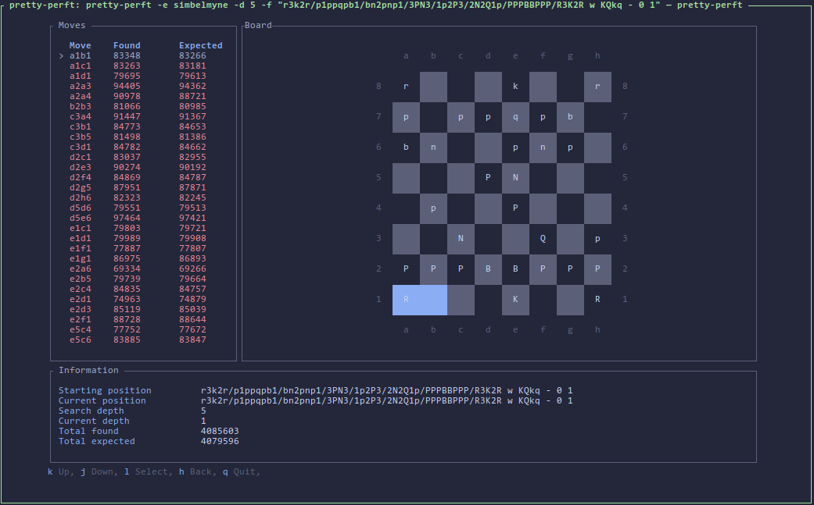

# Pretty Perft
A tool for debugging chess move generation



## How to install
The easiest way to install the project is to make sure you have `git` and 
`cargo` installed.
```sh
$ git clone https://github.com/sroelants/pretty-perft

$ cd pretty-perft
$ cargo build --release
```

Once pretty-perft is ready for a pre-release, binaries for all major platforms
and CPU architectures will be provided under [Releases](https://github.com/sroelants/pretty-perft/releases).

## Usage
`pretty-perft` supports two main modes of use

### Through UCI
```sh
$ pretty-perft --engine <engine> --fen <fen> --depth <depth>
```
When passed the binary of a UCI engine (with the `-e` flag), `pretty-perft` will 
communicate with the engine over UCI, and attempt to run `go perft n`.

`go perft n` is _not_ part of the UCI spec, but is implemented by Stockfish and
several other engines. If you already have a UCI engine, but are debugging
movegen for one reason or another (maybe you're in the middle of that 16th rewrite),
then implementing `go perft n` is an easy way to get your engine to work with
`pretty-perft`.

### Through a stand-alone script
```sh
$ pretty-perft --command <perft-script> --fen <fen> --depth <depth>
```
If you don't have an engine yet, you _probably_ also don't have a UCI
interpreter! For these cases, you can pass a stand-alone script or executable
with the `-c` flag that will output the split perft result. The script will be
called by `pretty-perft` as 

```
<script> <position fen> <depth>
```

### Expected output format
In the future, I'm aiming to make `pretty-perft` a little more lax in what kinds
of output it accepts. For now, it expects the output to be lines of `<coordinate
move>: <number of nodes>`, terminated by an extra newline. The output can 
optionally be followed by the total perft count, but anything after the first 
blank line will be ignored by `pretty-perft`.

Example:

```
❯ perft_script.sh "rnbqkbnr/pppppppp/8/8/8/8/PPPPPPPP/RNBQKBNR w KQkq - 0 1" 6
a2a3: 4463267
b2b3: 5310358
c2c3: 5417640
d2d3: 8073082
e2e3: 9726018
f2f3: 4404141
g2g3: 5346260
h2h3: 4463070
a2a4: 5363555
b2b4: 5293555
c2c4: 5866666
d2d4: 8879566
e2e4: 9771632
f2f4: 4890429
g2g4: 5239875
h2h4: 5385554
b1a3: 4856835
b1c3: 5708064
g1f3: 5723523
g1h3: 4877234

119060324
```

## What is perft debugging
### Perft as a testing tool
When writing a chess engine or library, the first hurdle to overcome is usually
generating all the legal moves for a given position (usually called"movegen").
Depending on the approach taken, this can be a painful process: there are many
edge cases, and it can be hard to know that all edge cases have been covered.

By far the most common way to check whether your movegen is correct, is to do
"perft" testing. One writes a function &mdash; usually called `perft`, for reasons 
lost to time &mdash; that recursively generates and counts all the legal moves
at a given depth:

```rust
fn perft(board: Board, depth: usize) -> u32 {
  if depth == 0 {
    return 1;
  }
  
  let mut count = 0;
  
  for mv in board.legal_moves() {
    count += perft(board.apply_move(mv), depth - 1)
  }
  
  return count;
}
```

This number can then be verified, either by looking up results online, or by
verifying with another engine whose movegen has already been thoroughly tested.
If your engine can predict the correct number of legal moves for a sufficiently
varied number of positions and sufficiently large depth, you have some amount of 
guarantee that your movegen is free of bugs.

### Split perft as a debugging tool
So, now we know how to detect whether or not our movegen has bugs. The problem
is: if there is a bug, how will I find out _where_ the bug is located? Movegen
is a pretty decent amount of complex code, with plenty of room for bugs to hide.

This is where _split perft_, also called _divide perft_ comes into play.
Instead of generating the total number of legal moves at a given depth, we 
list out all of the legal moves in the position, and the perft result obtained
_from that move onward_.

An example result, running a split perft at depth 6 for the starting position,
would look something like:

```
❯ simbelmyne divide -d 6
a2a3: 4463267
b2b3: 5310358
c2c3: 5417640
d2d3: 8073082
e2e3: 9726018
f2f3: 4404141
g2g3: 5346260
h2h3: 4463070
a2a4: 5363555
b2b4: 5293555
c2c4: 5866666
d2d4: 8879566
e2e4: 9771632
f2f4: 4890429
g2g4: 5239875
h2h4: 5385554
b1a3: 4856835
b1c3: 5708064
g1f3: 5723523
g1h3: 4877234

119060324
```

The number at the bottom represents the total perft result, and equals the sum 
of the individual split perft results.

Armed with this perft result, one can compare these numbers to the output of
another engine or library. If one of the moves reports a different number, then
we know that _somewhere_ after that move, we either generated an illegal move,
or forgot to generate a legal move. One can then take the board position after
playing that move, run the split perft again from this new position, and repeat
the process. This way, one can "walk down the tree" until we find a move that
is causing a discrepance.

### Other tools for split perft debugging

Doing split perft debugging like this works, but it is really cumbersome. There
are tools out there that help with this. [Webperft](https://analog-hors.github.io/webperft/) by @analog-hors
is an _excellent_ web-based tool for this. But, being web-based, it means you
have to constantly move back and forth between running your engine's perft, 
copy pasting the result into the browser, diffing the result, finding the 
erroneous move, and going back to your terminal. Still rather cumbersome...

Another tool that directly inspired pretty-perft is [perftree](https://github.com/agausmann/perftree).
Because it runs locally, you can directly plug in your own engine, and perftree
can generate the new perft results on the fly as you're walking down the tree.
The major downside to perftree is that it is entirely text-based. In order to 
figure out the actual board positions, one has to write down the moves as you
traverse the tree, and apply them to the board position some other way to figure
out what is actually going on.

If only there were a way to have the visual UI of webperft, but running
locally like perftree, so we can recompute the perft results on the fly...

# TODO:
## Non-negotiable
- [✓] "Command" mode: pass it the path to anything executable that takes a fen and
      depth, and returns a split perft.
- [✓] Testing with other engines
- [✓] Gracefully handle max-depth
- [✓] Off by one error in reporting panel?
- [ ] Proper error handling
- [ ] Error modal?
- [✓] Make diff table a scrollable list
- [✓] Make sure `Colored` works on Powershell/windows

## Down-the-line
- [✓] Add `?` keybinding for help modal, or something similar

## Nice-to-haves
- [ ] Scale board depending on the terminal size?
- [ ] Change fen/depth in-app?
- [ ] Expand globs?
- [ ] Update simbelmyne-chess library
  - Does this mean I need all the same compile targets (BMI2, etc)?

## Meta
- [ ] Write up nicer README
- [ ] Write github action for releases
- [ ] CI?
